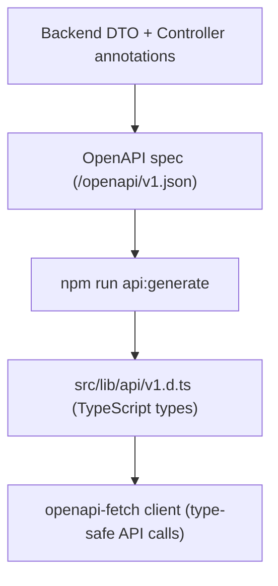

# API Contract & Type Generation

The OpenAPI spec at `/openapi/v1.json` is the single source of truth for the frontend. Every controller action, DTO, and status code generates TypeScript types consumed by the frontend via `openapi-typescript`. A sloppy spec means a sloppy frontend.

## The Pipeline



Every change to a backend response DTO (new field, renamed field, changed nullability) requires regenerating frontend types. The pipeline is:

1. Make backend changes
2. Ensure backend is running
3. Run `npm run api:generate` from `src/frontend/`
4. Run `npm run check` to catch any type errors
5. Commit `v1.d.ts` alongside the backend changes

---

## Spec Infrastructure

| Component | Purpose |
|---|---|
| `ProjectDocumentTransformer` | Sets API title, version, auth description |
| `CleanupDocumentTransformer` | Strips redundant content types (text/plain, text/json) and HEAD response bodies |
| `CamelCaseQueryParameterTransformer` | Converts PascalCase query param names to camelCase; propagates missing descriptions |
| `EnumSchemaTransformer` | String enums with all members listed; handles nullable enums |
| `NumericSchemaTransformer` | Ensures numeric types aren't serialized as strings |
| Scalar UI | Interactive API docs at `/scalar/v1` (dev only) |

---

## DTO Design Principles

### Two DTO Layers

| Layer | Naming | Format | Purpose |
|---|---|---|---|
| WebApi | `{Operation}Request` / `{Entity}Response` | Classes with `init` properties | HTTP contract — validation, OAS annotations |
| Application | `{Operation}Input` / `{Entity}Output` | Records | Business contract — no HTTP concerns |

The WebApi DTOs are the **API surface**. Their nullability, property names, and validation annotations directly control the OpenAPI spec and therefore the generated TypeScript types. Changes to these DTOs have frontend-facing consequences.

### Nullability Is the API Contract

```csharp
public string Email { get; init; } = string.Empty;  // → required, non-nullable in TypeScript
public string? FirstName { get; init; }              // → optional, T | undefined in TypeScript
```

Getting nullability wrong means the frontend types are wrong. A `string` property that can actually be null will cause runtime errors in TypeScript code that assumes it's always present.

### Validation Annotations Flow to the Spec

```csharp
[MaxLength(255)]    // → maxLength: 255 in OAS
[MinLength(6)]      // → minLength: 6
[Range(1, 100)]     // → minimum: 1, maximum: 100
[EmailAddress]      // → format: email
```

These annotations serve double duty: runtime validation AND spec documentation. Always add them to request DTOs.

---

## Controller Annotations

Every endpoint must have complete annotations. Missing annotations produce an incomplete spec, which produces incomplete TypeScript types.

### Required on Every Action

| Annotation | Why |
|---|---|
| `/// <summary>` | Becomes the operation description |
| `/// <param>` | Documents visible parameters (request body, route, query) |
| `/// <response code="...">` | Documents each status code's meaning |
| `[ProducesResponseType(typeof(T), StatusCode)]` | Generates the response schema |
| `ActionResult<T>` return type | Reinforces the 200-response schema |

### CancellationToken Exception

Never add `/// <param name="cancellationToken">` — ASP.NET excludes `CancellationToken` from OAS parameters, but the `<param>` text leaks into `requestBody.description`. CS1573 (missing param docs warning) is suppressed project-wide because omitting CancellationToken docs is intentional.

### Response Type Rules

- **`typeof(T)` on success codes** — `[ProducesResponseType(typeof(UserResponse), StatusCodes.Status200OK)]`
- **`typeof(ErrorResponse)` on error codes with bodies** — `[ProducesResponseType(typeof(ErrorResponse), StatusCodes.Status400BadRequest)]`
- **No type on bodyless codes** — `[ProducesResponseType(StatusCodes.Status401Unauthorized)]`
- **Never `StatusCode(int, object)`** — loses type info, OAS generator can't introspect the response schema
- **Never anonymous objects** — `new { message = "..." }` produces untyped schemas

---

## Enum Handling in the Spec

Enums are always strings in the API. The `EnumSchemaTransformer` ensures:

1. `type: string` (not integer)
2. All enum members listed in the `enum` array
3. Nullable enums (`MyEnum?`) produce `type: [string, null]`

**Generated TypeScript:**

```typescript
// Non-nullable
status: "Pending" | "Processing" | "Shipped" | "Delivered" | "Cancelled";

// Nullable
status?: "Pending" | "Processing" | "Shipped" | "Delivered" | "Cancelled";
```

If you see `unknown` in generated types for an enum field, something is wrong with the transformer or annotations.

---

## Frontend Type Usage

### Automatic Inference

Response types are inferred automatically through the API client:

```typescript
const { data } = await browserClient.GET('/api/users/me');
// data is typed as UserResponse | undefined
```

### Explicit Imports

For type annotations outside of API calls:

```typescript
import type { components } from '$lib/api/v1';
type User = components['schemas']['UserResponse'];
```

### Type Aliases

Commonly used schemas get aliases in `$lib/types/index.ts`:

```typescript
import type { components } from '$lib/api/v1';
export type User = components['schemas']['UserResponse'];
```

---

## XML Documentation

All public and internal API surface must have `/// <summary>` XML docs. This includes:

| Item | What to Document |
|---|---|
| Interfaces | Contract purpose, each method's semantics |
| Extension classes | What they configure, parameters, side effects |
| Middleware | Which exceptions map to which status codes |
| Base classes | What inheritors get for free |
| Options classes | What they configure, constraints, defaults |
| Controllers | What each action does |
| DTOs | Every class and every property |

XML docs on DTOs become property descriptions in the OAS schema. Without them, the frontend developer has no idea what a field means or expects.

---

## Compliance Checklist

Before adding or modifying any endpoint:

- [ ] `/// <summary>` on the controller action
- [ ] `/// <param>` for visible parameters (never for `CancellationToken`)
- [ ] `/// <response code="...">` for every status code
- [ ] `[ProducesResponseType]` for every status code with appropriate `typeof(T)`
- [ ] `ActionResult<T>` return type for success bodies
- [ ] Error responses use `ErrorResponse`, not raw strings or anonymous objects
- [ ] `/// <summary>` on every DTO class and property
- [ ] Correct nullability matching the API contract
- [ ] Data annotations on request DTOs
- [ ] `CancellationToken` as last parameter, passed through to services
- [ ] Enums verified in Scalar (string type, all members listed)
- [ ] After DTO changes: `npm run api:generate` → commit `v1.d.ts`
