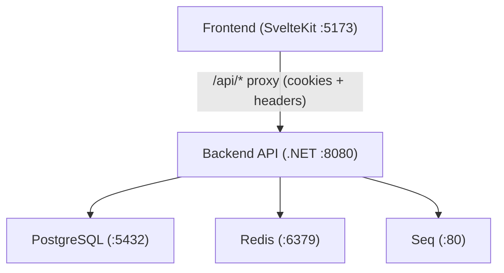
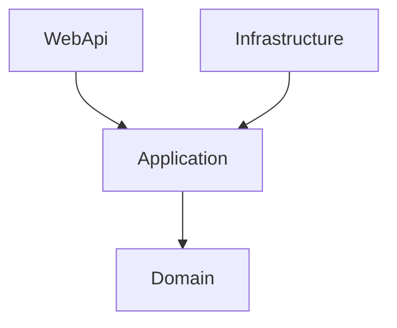
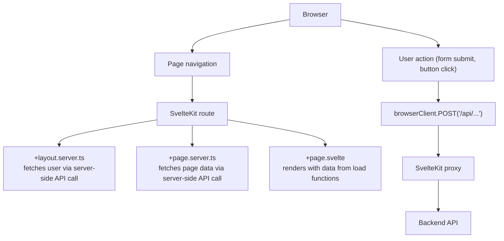
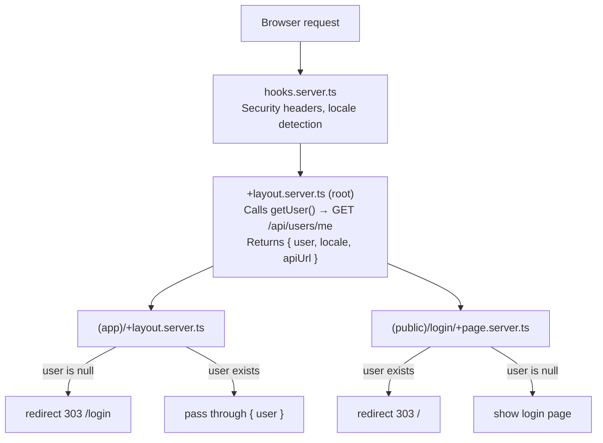
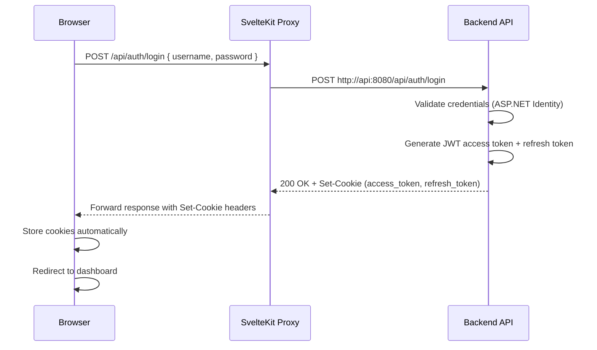
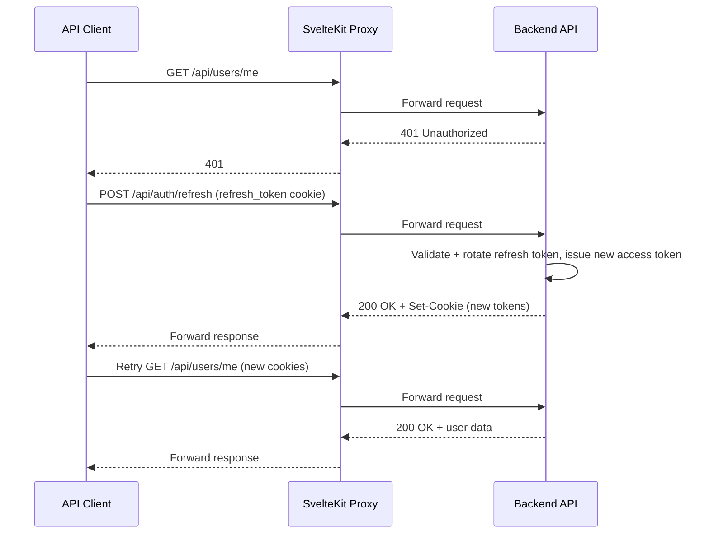

# Architecture

Full-stack web application template: **.NET 10 API** (Clean Architecture) + **SvelteKit frontend** (Svelte 5), fully dockerized.

## System Overview

The frontend never talks to the database or Redis directly. All data access goes through the backend API. The SvelteKit server acts as a BFF (Backend-for-Frontend), proxying `/api/*` requests to the .NET API and forwarding cookies transparently.

## Tech Stack

| | Backend | Frontend |
|---|---|---|
| **Framework** | .NET 10 / C# 13 | SvelteKit / Svelte 5 (Runes) |
| **Database** | PostgreSQL + EF Core | — |
| **Caching** | Redis (IDistributedCache) | — |
| **Auth** | JWT in HttpOnly cookies | Cookie-based (automatic via API proxy) |
| **Validation** | FluentValidation + Data Annotations | TypeScript strict mode |
| **API Docs** | Scalar (OpenAPI at `/openapi/v1.json`) | openapi-typescript (generated types) |
| **Styling** | — | Tailwind CSS 4 + shadcn-svelte (bits-ui) |
| **i18n** | — | paraglide-js (type-safe, compile-time) |
| **Logging** | Serilog → Seq | — |

## Backend — Clean Architecture

### Layer Responsibilities

| Layer | Responsibility | References |
|---|---|---|
| **Domain** | Entities, value objects, `Result` pattern. Zero external dependencies. | Nothing |
| **Application** | Interfaces, DTOs (Input/Output), service contracts. Defines *what* the system can do. | Domain only |
| **Infrastructure** | EF Core, Identity, Redis, service implementations. Implements *how* it's done. | Application + Domain |
| **WebApi** | Controllers, middleware, validation, request/response DTOs. HTTP entry point. | Application + Domain (not Infrastructure directly) |

### Dependency Rule

Dependencies point **inward**. Domain has no dependencies. Application depends only on Domain. Infrastructure and WebApi depend on Application (and transitively on Domain). WebApi never references Infrastructure types directly — it depends on Application interfaces, and DI wires in Infrastructure implementations at startup.

### Why Clean Architecture

- **Testability** — business logic in Application/Domain is testable without HTTP, database, or cache concerns.
- **Replaceability** — swap PostgreSQL for another database by changing Infrastructure only. Application contracts don't change.
- **Separation of concerns** — controllers handle HTTP, services handle business logic, repositories handle data access. Each layer has one job.

## Frontend — SvelteKit

| Directory | Responsibility |
|---|---|
| `src/routes/(app)/` | Authenticated pages (redirect guard in layout) |
| `src/routes/(public)/` | Public pages (login) |
| `src/routes/api/` | API proxy to backend |
| `src/lib/api/` | Type-safe API client + generated OpenAPI types |
| `src/lib/components/` | Feature-organized components with barrel exports |
| `src/lib/state/` | Reactive state (`.svelte.ts` files) |
| `src/lib/config/` | App configuration (client-safe vs server-only split) |

### Request Flow

### Authentication Flow

The root layout fetches the user **once** via `getUser()`. All child layouts access the user through `parent()` — they never re-fetch.

## API Proxy

The SvelteKit server proxies all `/api/*` requests to the .NET backend. This is implemented as a catch-all server route at `routes/api/[...path]/+server.ts`.

**Why a proxy instead of direct browser-to-API calls:**

- **Cookie forwarding** — HttpOnly cookies (JWT access + refresh tokens) are set by the backend and forwarded transparently by the proxy. The browser never sees or handles JWT tokens.
- **CORS elimination** — same-origin requests from browser to SvelteKit, then server-to-server from SvelteKit to backend. No CORS headers needed in production.
- **Security header filtering** — the proxy allowlists which request/response headers pass through, preventing header injection.
- **CSRF protection** — the proxy validates Origin headers on state-changing requests (POST/PUT/PATCH/DELETE).

## Error Handling

Error handling follows a consistent strategy across the stack:

| Layer | Strategy |
|---|---|
| **Backend services** | Return `Result` / `Result<T>` for expected failures |
| **Backend exceptions** | `KeyNotFoundException` → 404, `PaginationException` → 400, unhandled → 500 |
| **Backend middleware** | `ExceptionHandlingMiddleware` catches all, returns `ErrorResponse` JSON |
| **Frontend API errors** | `isValidationProblemDetails()` → field-level errors with shake animation |
| **Frontend generic errors** | `getErrorMessage()` → toast notification |
| **Frontend network errors** | `isFetchErrorWithCode('ECONNREFUSED')` → 503 "Backend unavailable" |

The `ErrorResponse` type is the **only** error body shape across the entire API — both controllers and middleware return it. The frontend's error handling utilities are designed around this single shape.

## Data Flow Example: Login

## Data Flow Example: Token Refresh

Concurrent requests that hit 401 share a single refresh promise — only one refresh call is made, and all waiting requests retry after it resolves.
