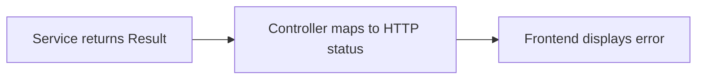
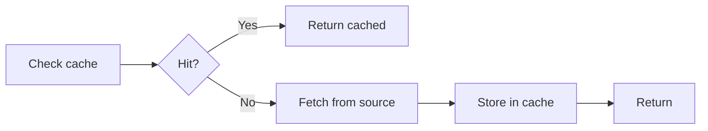

# Backend Conventions (.NET 10 / C# 13)

This document explains the patterns, conventions, and design decisions used in the backend. For quick-reference rules and code templates, see [`src/backend/AGENTS.md`](../src/backend/AGENTS.md).

## Code Quality Principles

These apply across the entire codebase — backend and frontend alike.

### Keep Structures Clean

Public methods should read like a table of contents — delegate implementation details to well-named private methods. If a method does three things, it should call three methods, not contain three inline blocks.

### Deduplicate When It Improves Clarity

When the same pattern appears more than once, extract it. But don't abstract prematurely — duplication is cheaper than the wrong abstraction. Extract when:

- The duplicated logic is **identical in intent**, not just similar in shape
- A change to one copy would always require the same change to the others
- The extracted method has a **clear, descriptive name** that improves readability

If the "shared" code would need parameters, flags, or conditionals to handle different callers, it's not real duplication — leave it inline.

### Design for Testability

Write code that is naturally testable through good structure, not by over-abstracting for the sake of mocking:

- **Small, focused methods** — easier to test in isolation
- **Constructor injection** — dependencies are explicit and swappable
- **Pure logic where possible** — methods that take inputs and return outputs without side effects are trivially testable
- **Don't wrap framework types just to mock them** — if testing requires mocking `HttpContext` or `DbContext`, use integration tests instead of creating abstraction layers that exist only for unit tests

---

## Entity Design

### BaseEntity

All domain entities extend `BaseEntity`, which provides audit fields and soft delete. The `AuditingInterceptor` automatically populates `CreatedAt`/`CreatedBy` on insert, `UpdatedAt`/`UpdatedBy` on update, and `DeletedAt`/`DeletedBy` on soft delete. Never set audit fields manually.

**Design decisions:**

- **Private setters** on all entity properties — enforce invariants through domain methods, not external mutation.
- **Protected parameterless constructor** for EF Core materialization — EF needs it, but callers can't use it.
- **Generate `Id` in the public constructor** — entities are always created with an identity.
- **Soft delete over hard delete** — `IsDeleted` flag with automatic query filtering. Hard delete would lose audit history and break referential integrity.

### Why the Result Pattern

Business logic failures (invalid credentials, duplicate email, etc.) are **expected outcomes**, not exceptional situations. Throwing exceptions for control flow is:

1. **Expensive** — exception creation captures stack traces, which is orders of magnitude slower than returning a value.
2. **Semantically wrong** — "wrong password" isn't exceptional, it's a normal branch.
3. **Hard to reason about** — exception-based flow scatters error handling across catch blocks instead of making it visible at the call site.

`Result` / `Result<T>` makes success and failure explicit at every level:

Exceptions are reserved for truly unexpected situations (database down, null reference, etc.) that `ExceptionHandlingMiddleware` catches and maps to 500.

---

## Service Composition

### The Full Pipeline

Each step has a specific responsibility:

| Step | Type | Layer | Purpose |
|---|---|---|---|
| Receive | `{Operation}Request` | WebApi | HTTP contract — validated by FluentValidation |
| Map | `{Feature}Mapper` | WebApi | Convert Request → Input (decouple HTTP from business) |
| Process | `I{Feature}Service` | Application (interface), Infrastructure (impl) | Business logic |
| Return | `Result` / `Result<T>` | Domain | Success/failure outcome |
| Respond | `{Entity}Response` | WebApi | HTTP response — mapped from Output |

### Why Two DTO Layers

**Request/Response DTOs** (WebApi) represent the HTTP contract. They have validation attributes, `[UsedImplicitly]` annotations, and XML docs that generate OpenAPI descriptions. They can change independently of business logic.

**Input/Output DTOs** (Application) represent the business contract. They're simple records with no HTTP concerns. Multiple controllers or entry points (API, CLI, background jobs) could produce the same Input.

This separation means:

- Adding a field to the API response doesn't require changing the service interface
- Renaming a JSON property doesn't ripple through the business layer
- Internal services can call each other using Input/Output without constructing HTTP DTOs

### Access Modifier Strategy

Infrastructure service implementations are `internal` — they're never referenced directly outside their assembly. The only way to access them is through their Application-layer interface via DI. This enforces the Clean Architecture dependency rule at compile time.

### DI Registration — C# 13 Extension Members

All DI registration uses the C# 13 extension member syntax (not the classic `this` parameter style). This is a project-wide convention for consistency. See [`src/backend/AGENTS.md`](../src/backend/AGENTS.md) for the syntax template.

---

## Persistence

### Repository Pattern

The generic `IBaseEntityRepository<T>` provides standard CRUD operations with automatic soft-delete filtering. A global query filter (`HasQueryFilter(e => !e.IsDeleted)`) in `BaseEntityConfiguration` ensures soft-deleted records are excluded from all queries by default.

**When to use the generic repository:** For entities that only need standard CRUD (get by ID, list all, add, update, soft delete, restore, exists check).

**When to create a custom repository:** When an entity needs queries beyond CRUD — filtering by foreign key, searching by unique field, complex joins. The custom repository extends `IBaseEntityRepository<T>` to inherit CRUD operations while adding entity-specific methods.

**Key design decisions:**

- **Repositories return materialized objects, never `IQueryable`** — all repository methods call `ToListAsync`, `FirstOrDefaultAsync`, etc. before returning. The repository is the query boundary; services don't compose additional LINQ on top. If a service needs a different query shape, add a new method to the repository.
- **Repositories stage changes — services save them** — `SaveChangesAsync` is called by the service, not the repository. This keeps the save boundary explicit and lets a service coordinate multiple repository calls into a single atomic save.
- **Single `SaveChangesAsync` is implicitly transactional** — EF Core wraps all pending changes in a single database transaction. For most operations, this is sufficient.
- **Explicit transactions only for multi-save coordination** — use `BeginTransactionAsync` / `CommitAsync` only when you need multiple `SaveChangesAsync` calls to succeed or fail together (e.g., when you need an ID from the first save to use in the second).

### Optimistic Concurrency

Not enforced globally yet. When a use case emerges (concurrent writes to inventory, order status, etc.), the strategy will be decided per-entity. Options include EF Core's `[ConcurrencyCheck]`, `IsConcurrencyToken()`, or PostgreSQL's `xmin` system column.

---

## Validation

Two validation systems work together:

| System | Purpose | Location |
|---|---|---|
| **Data Annotations** | Simple constraints (`[Required]`, `[MaxLength]`, `[Range]`) + OpenAPI spec generation | On DTOs |
| **FluentValidation** | Complex rules, cross-field validation, conditional logic | Co-located with request DTOs |

Data annotations serve double duty — they validate at runtime AND flow into the OpenAPI spec as schema constraints (e.g., `[MaxLength(255)]` → `maxLength: 255`). FluentValidation handles rules that annotations can't express.

Validators are auto-discovered from the WebApi assembly via `AddValidatorsFromAssemblyContaining<Program>()`.

---

## Options Pattern

Configuration follows the ASP.NET Options pattern with startup validation:

1. **Declare** — `public sealed class` with `const string SectionName`, `init`-only properties, data annotations
2. **Nest** — child options are `public sealed class` inside the parent, bound automatically (no separate registration)
3. **Validate** — `[ValidateObjectMembers]` recurses into child objects; `IValidatableObject` for cross-property rules
4. **Register** — `AddOptions<T>().BindConfiguration().ValidateDataAnnotations().ValidateOnStart()`
5. **Consume** — `IOptions<T>` in services (never `IOptionsMonitor` or `IOptionsSnapshot`)

**Why `ValidateOnStart()`:** Fail fast. Configuration errors surface immediately at startup, not when the first request hits the service. In production, this means a bad deploy fails during health check, not in front of a user.

**Why `sealed`:** Options classes have no inheritance hierarchy. Sealing them communicates intent and enables minor compiler optimizations.

**Why `[ValidateObjectMembers]`:** Without it, `ValidateDataAnnotations()` only checks the root class. Annotations on nested objects (e.g., `JwtOptions.Key` with `[MinLength(32)]`) are silently ignored. This was a real bug we caught — the JWT key could be empty without this attribute.

---

## Caching

`ICacheService` wraps Redis with JSON serialization. The primary pattern is cache-aside via `GetOrSetAsync`:

Cache keys are defined as static methods in `CacheKeys` (e.g., `CacheKeys.User(userId)` → `"user:{guid}"`). This prevents typos and ensures consistent key formats.

The `UserCacheInvalidationInterceptor` automatically invalidates user cache entries when `ApplicationUser` entities are modified — no manual invalidation needed for user data.

---

## Controller Conventions

### Two Base Classes

| Base | Route | Auth | Use For |
|---|---|---|---|
| `ApiController` | `api/v1/[controller]` | `[Authorize]` | Versioned business endpoints |
| `ControllerBase` | `api/[controller]` | None (add manually) | Unversioned identity/auth endpoints |

**Why the split:** Authentication endpoints (`/api/auth/login`, `/api/auth/refresh`) are a stable identity contract that shouldn't be versioned. Business endpoints (`/api/v1/users`, `/api/v1/orders`) evolve with the application and benefit from versioning.

### Response Conventions

- **Success with body** — `Ok(response)`, `Created(string.Empty, response)`
- **Success without body** — `Ok()`, `NoContent()`
- **Errors** — always `new ErrorResponse { Message = ... }`, never raw strings or anonymous objects
- **201 Created** — use `Created(string.Empty, response)`, not `CreatedAtAction` (generates MVC-style Location headers this API doesn't need) or `StatusCode(201, response)` (loses type info for OAS)

---

## Enum Handling

Enums are **strings in the API, integers in the database**:

| Layer | Format | Mechanism |
|---|---|---|
| JSON responses | `"Shipped"` | `JsonStringEnumConverter` in `Program.cs` |
| OpenAPI spec | `type: string, enum: [...]` | `EnumSchemaTransformer` |
| TypeScript | `"Shipped" \| "Delivered"` | Generated from OAS |
| Database | `2` (integer) | EF Core default + `.HasComment()` |

**Why strings in API:** Human-readable, self-documenting, and frontend-friendly. No need to look up what `2` means.

**Why integers in database:** Compact storage, fast indexing. The `.HasComment()` documents valid values for anyone querying raw data.

**Why explicit integer values on enum members:** Inserting a member between existing ones would silently shift all subsequent values and corrupt stored data. Always assign explicit values: `Pending = 0, Processing = 1, ...`.
