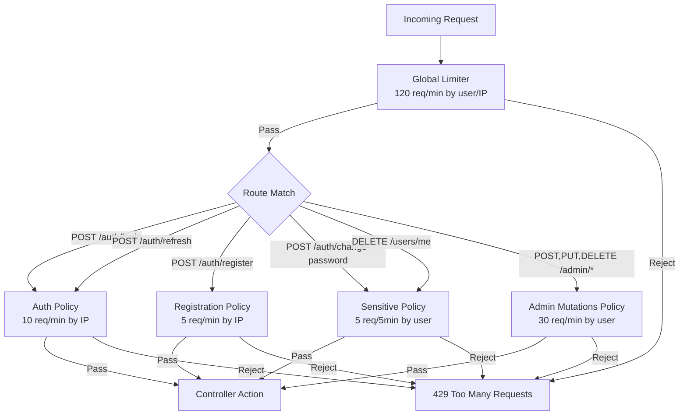

# Admin API Hardening

**Date**: 2026-02-14
**Scope**: Validation gaps, system role collision checks, path parameter constraints, and per-endpoint rate limiting across admin, auth, and user APIs

## Summary

Comprehensive security hardening pass across all API endpoints. Added system role name collision checks to prevent creating/renaming roles to reserved names. Constrained all unvalidated string path parameters with regex and length route constraints. Introduced three new rate limiting policies (auth, sensitive, admin-mutations) applied to every state-changing endpoint beyond the global limiter.

## Changes Made

| File | Change | Reason |
|------|--------|--------|
| `Domain/ErrorMessages.cs` | Added `Roles.SystemRoleNameReserved` | Error message for system role name collision |
| `Infrastructure/.../RoleManagementService.cs` | Case-insensitive check against `AppRoles.All` in `CreateRoleAsync` and `UpdateRoleAsync` | Prevent creating/renaming roles to "Admin", "user", "SUPERADMIN", etc. |
| `WebApi/.../AdminController.cs` | Added `maxlength(50)` + regex route constraint on `{role}` param; added `[EnableRateLimiting]` on 9 state-changing endpoints | Parity with `AssignRoleRequestValidator`; dedicated rate limit for admin mutations |
| `WebApi/.../JobsController.cs` | Added `maxlength(100)` + regex route constraint on all `{jobId}` params; added `[EnableRateLimiting]` on 5 state-changing endpoints | Previously unvalidated string params; dedicated rate limit |
| `WebApi/.../AuthController.cs` | Added `[EnableRateLimiting("auth")]` on login/refresh; `[EnableRateLimiting("sensitive")]` on change-password; added 429 response types | Login/refresh are brute-force vectors; password change is a sensitive op |
| `WebApi/.../UsersController.cs` | Added `[EnableRateLimiting("sensitive")]` on delete-account; added 429 response type | Account deletion is irreversible and sensitive |
| `WebApi/.../RefreshRequestValidator.cs` | New file: validates `RefreshToken` max length 500 when provided | Previously had no validator; unbounded string input |
| `WebApi/Options/RateLimitingOptions.cs` | Added `AuthLimitOptions` (10/min by IP), `SensitiveLimitOptions` (5/5min by user), `AdminMutationsLimitOptions` (30/min by user) | Dedicated policies for different threat profiles |
| `WebApi/Extensions/RateLimiterExtensions.cs` | Registered `auth`, `sensitive`, and `admin-mutations` policies | Wire up the new policies |
| `appsettings.json` | Added `Auth`, `Sensitive`, `AdminMutations` sections | Production rate limit defaults |
| `appsettings.Development.json` | Added same sections with relaxed limits | Dev-friendly limits (300 req/10s) |

## Decisions & Reasoning

### Three separate rate limit policies instead of one

- **Choice**: Separate `auth` (by IP), `sensitive` (by user), and `admin-mutations` (by user) policies
- **Alternatives considered**: Single "strict" policy for all non-GET endpoints; two policies (auth + everything else)
- **Reasoning**: Different threat models require different partitioning strategies. Auth endpoints are unauthenticated (partition by IP to stop brute-force). Sensitive user ops are authenticated (partition by user to prevent abuse). Admin mutations are already behind permission checks but need throughput limits against compromised admin accounts.

### Route constraints vs action filters for path parameter validation

- **Choice**: ASP.NET route constraints (`maxlength`, `regex`) directly in route templates
- **Alternatives considered**: Custom `IActionFilter` or `[FromRoute]` with FluentValidation
- **Reasoning**: Route constraints reject invalid requests at the routing layer before model binding, reducing attack surface. Non-matching routes return 404 automatically, which is the correct response for an invalid path segment. No custom code required.

### RefreshToken max length 500

- **Choice**: 500-character limit on refresh token body parameter
- **Alternatives considered**: No limit (trust backend validation), stricter limit (256)
- **Reasoning**: Refresh tokens in this system are 64-byte random values base64-encoded (~88 chars), but allowing headroom for format changes. 500 is generous enough to never break legitimate tokens while preventing multi-megabyte payloads.

## Diagrams

## Follow-Up Items

- [ ] Consider adding rate limiting to the `POST /auth/logout` endpoint (low priority since it requires authentication and is idempotent)
- [ ] Monitor production rate limit hit rates via Seq to tune thresholds
- [ ] Consider sliding window instead of fixed window for auth policy to prevent burst timing attacks at window boundaries
