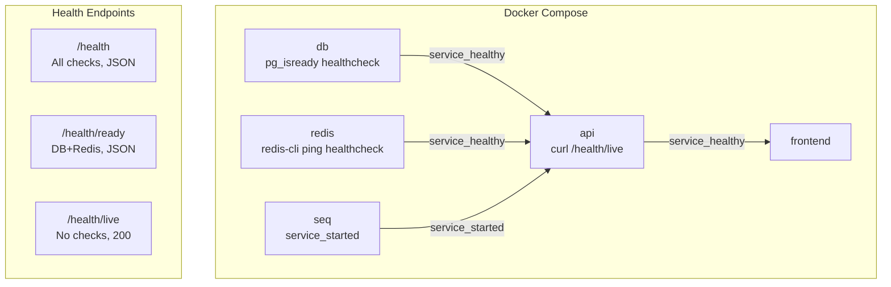

# Health Check Endpoints with Dependency Verification

**Date**: 2026-02-14
**Scope**: Add health check endpoints with PostgreSQL/Redis verification, liveness/readiness split, Docker healthcheck directives

## Summary

Replaced the bare `AddHealthChecks()` / `MapHealthChecks("/health")` with proper dependency verification using `AspNetCore.HealthChecks.NpgSql` and `AspNetCore.HealthChecks.Redis`. Added three endpoints (`/health`, `/health/ready`, `/health/live`) with rate limiting disabled, Docker healthcheck directives for all services, and conditional `depends_on` with `service_healthy`.

## Changes Made

| File | Change | Reason |
|------|--------|--------|
| `src/backend/Directory.Packages.props` | Added `AspNetCore.HealthChecks.NpgSql` and `AspNetCore.HealthChecks.Redis` packages | NuGet version centralization |
| `src/backend/MyProject.WebApi/MyProject.WebApi.csproj` | Added package references (no version) | Project needs health check libraries |
| `src/backend/MyProject.WebApi/Extensions/HealthCheckExtensions.cs` | New file with `AddApplicationHealthChecks` and `MapHealthCheckEndpoints` | Encapsulate health check registration and endpoint mapping |
| `src/backend/MyProject.WebApi/Program.cs` | Replaced `AddHealthChecks()` → `AddApplicationHealthChecks(...)`, `MapHealthChecks("/health")` → `MapHealthCheckEndpoints()` | Wire up new health check infrastructure |
| `docker-compose.local.yml` | Added healthcheck directives to db/redis/api, conditional `depends_on` for api/frontend | Proper startup ordering and health verification |
| `src/frontend/src/routes/api/health/+server.ts` | Forward backend Content-Type instead of hardcoded `text/plain` | Health endpoint now returns JSON |
| `FILEMAP.md` | Added health check impact row | Change impact tracking |

## Decisions & Reasoning

### Three-endpoint split (health/ready/live)

- **Choice**: `/health` (all checks), `/health/ready` (DB+Redis), `/health/live` (no checks, always 200)
- **Alternatives considered**: Single endpoint, two endpoints (ready/live only)
- **Reasoning**: Kubernetes-style pattern. `/health/live` for Docker healthcheck (container is running), `/health/ready` for load balancer readiness (dependencies available), `/health` for full diagnostics.

### Docker healthcheck uses /health/live, not /health/ready

- **Choice**: API container uses liveness endpoint for Docker health status
- **Alternatives considered**: Using `/health/ready` which checks DB+Redis
- **Reasoning**: Docker healthcheck determines if the container process is alive. If DB is temporarily down, the API container itself is still healthy — it shouldn't be restarted. Readiness is for traffic routing decisions, not container lifecycle.

### No Seq health check

- **Choice**: Seq uses `service_started`, not `service_healthy`
- **Alternatives considered**: Adding a Seq HTTP health check
- **Reasoning**: Seq is a logging sink. If Seq is down, the application is still fully functional — logs just won't reach the dashboard. Making the app "unhealthy" due to Seq would cause unnecessary restarts.

### Redis check conditional on configuration

- **Choice**: Redis health check only registered when `Caching.Redis.Enabled` is true
- **Alternatives considered**: Always registering Redis check
- **Reasoning**: The app supports in-memory cache fallback. Registering a Redis check when Redis is disabled would always fail.

## Diagrams

## Follow-Up Items

- [ ] Consider adding health check endpoint to OpenAPI spec if public documentation is desired
