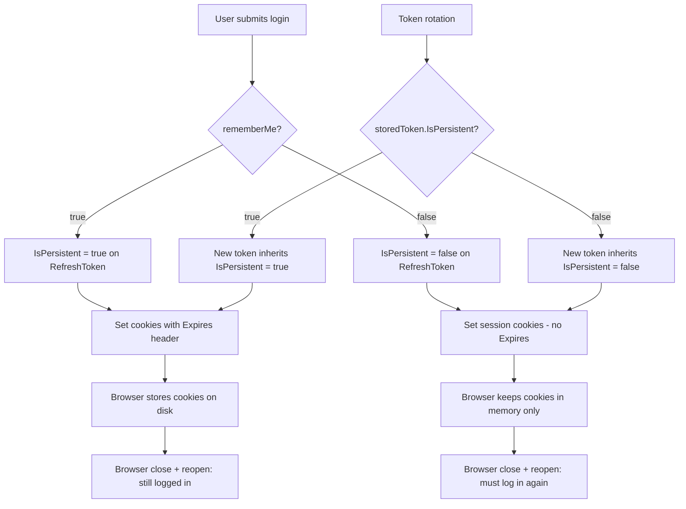

# Remember Me Login Option

**Date**: 2026-02-14
**Scope**: Adding a "remember me" checkbox to the login form that controls whether authentication cookies persist across browser restarts.

## Summary

All sessions previously used persistent cookies with explicit expiry dates, meaning the browser kept the user logged in until the token expired — regardless of whether the user wanted that. We added a "remember me" opt-in: without it, session cookies are used (cleared on browser close); with it, persistent cookies are set with explicit expiry so the session survives restarts. The user's choice is stored on the `RefreshToken` entity so it propagates through silent token rotations automatically.

## Changes Made

| File | Change | Reason |
|------|--------|--------|
| `RefreshToken.cs` | Added `IsPersistent` bool property | Store the user's remember-me intent so it survives token rotation |
| `RefreshTokenConfiguration.cs` | Configured `IsPersistent` as required with `DEFAULT false` | Existing tokens default to session cookies (safer) |
| `IAuthenticationService.cs` | Added `bool rememberMe = false` param to `Login` | Expose the option through the application interface |
| `AuthenticationService.cs` | Set `IsPersistent` on entity, extracted `SetAuthCookies` helper | Conditional cookie expiry; DRY between Login and RefreshTokenAsync |
| `LoginRequest.cs` | Added `RememberMe` bool property | Accept the flag from the request body |
| `AuthController.cs` | Pass `request.RememberMe` to service | Wire DTO to service |
| `LoginForm.svelte` | Added checkbox with `rememberMe` state, passed in API body | Frontend UI for the option |
| `en.json` / `cs.json` | Added `auth_login_rememberMe` translations | i18n support |

## Decisions & Reasoning

### `rememberMe` in request body, not query param

- **Choice**: Body field on `LoginRequest`
- **Alternatives considered**: Query parameter like `useCookies`
- **Reasoning**: `useCookies` is a transport concern (cookie vs Bearer) set by the proxy layer. `rememberMe` is user intent — it belongs in the request body alongside credentials.

### `IsPersistent` on the `RefreshToken` entity

- **Choice**: Boolean column on the token table
- **Alternatives considered**: (1) Extra parameter on `RefreshTokenAsync`, (2) Separate session metadata table
- **Reasoning**: `RefreshTokenAsync` runs independently of login — it doesn't receive the user's original choice. Storing it on the entity lets the refresh flow read it directly without leaking UX concerns into the API. A separate table would be over-engineering for a single boolean.

### Session cookies as default (`IsPersistent = false`)

- **Choice**: Without "remember me", cookies have no `Expires` header
- **Alternatives considered**: Always persistent with shorter expiry
- **Reasoning**: Session cookies are the safer default — if a user walks away from a shared computer and closes the browser, they're logged out. Existing tokens after migration also default to session cookies on next rotation.

### DB token lifetime unchanged

- **Choice**: Token expiry (configured via appsettings/env) stays the same regardless of `IsPersistent`
- **Alternatives considered**: Shorter DB lifetime for non-persistent sessions
- **Reasoning**: The DB expiry is a security boundary. Cookie persistence is a UX convenience. Mixing them would create confusing behavior — a "remembered" session shouldn't have a different security posture than a non-remembered one.

## Diagrams

## Follow-Up Items

- [ ] Chromium "Continue where you left off" restores session cookies — document this known browser behavior
