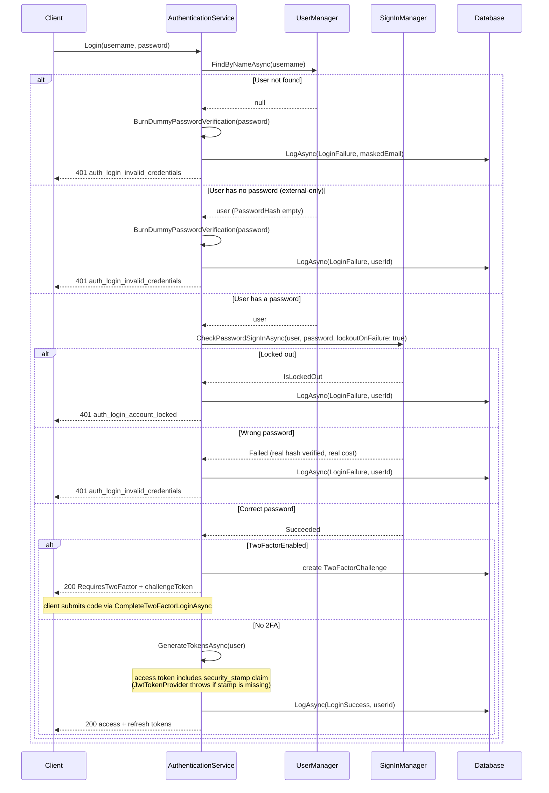

# Auth Security Hardening

**Date**: 2026-08-23
**Scope**: Security audit of the authentication/authorization subsystem, followed by fixes on branch `fix/auth-security-hardening`

## Summary

A security audit reviewed login, registration, password reset/change, JWT issuance/validation, and role/permission management. The overall design was judged strong (refresh-token rotation with reuse detection, security-stamp-based revocation, rank-based role management with escalation guards, default-deny permissions). The audit surfaced seven findings (one high, four medium, two low), all fixed in a single commit, `a309b568`, plus a follow-up round addressing four residual issues found during review.

## Changes Made

| File | Change | Reason |
|------|--------|--------|
| `src/backend/MyProject.Shared/PiiMasker.cs` | Moved from `MyProject.WebApi/Features/Admin` to `MyProject.Shared` | Infrastructure cannot reference WebApi; masking is now needed in `AuthenticationService`, `ExternalAuthService`, `AdminService`, and `ApplicationBuilderExtensions` |
| `src/backend/tests/MyProject.Unit.Tests/Shared/PiiMaskerTests.cs` | Moved test file alongside the relocated class | Keep tests co-located with the code they cover |
| `src/backend/MyProject.WebApi/Features/Admin/AdminMapper.cs` | Updated `using` to `MyProject.Shared` | Follows the `PiiMasker` move |
| `src/backend/MyProject.Infrastructure/Features/Authentication/Services/AuthenticationService.cs` | `LoginFailure` audit metadata masks the attempted email with `PiiMasker.MaskEmail`; `Register` returns the static `RegistrationInvalid` message instead of echoing Identity error descriptions; `ChangePasswordAsync`/`ResetPasswordAsync` return static messages, log only Identity error codes; `ForgotPasswordAsync` logs the masked email instead of the raw one; unknown-user and passwordless-account login paths both call `BurnDummyPasswordVerification` before returning the generic failure | H2: unmasked email in audit metadata; M7: email enumeration via Identity error text; L3: PII in logs; L2: timing side channel between unknown/passwordless/wrong-password login attempts |
| `src/backend/MyProject.Infrastructure/Features/Authentication/Services/AuthenticationService.cs` | Added `BurnDummyPasswordVerification`, hashing/verifying against a lazily-computed dummy hash via `UserManager.PasswordHasher` (the DI-configured hasher, not a hardcoded algorithm) | L2: keeps login response timing indistinguishable across unknown user, passwordless account, and wrong-password cases, at the real hasher's work factor |
| `src/backend/MyProject.Infrastructure/Features/Authentication/Services/JwtTokenProvider.cs` | Throws `InvalidOperationException` if `user.SecurityStamp` is null/empty before issuing an access token | M1: guarantees every issued token carries the security-stamp claim, closing the fail-open gap at validation |
| `src/backend/MyProject.Infrastructure/Features/Authentication/Extensions/ServiceCollectionExtensions.cs` | `ValidateSecurityStampAsync` now calls `context.Fail(...)` when the stamp claim is missing, instead of accepting the token | M1: rejects tokens issued before this change or forged without the claim; 10-minute access token lifetime keeps the migration window small |
| `src/backend/MyProject.Infrastructure/Features/Authentication/Options/AuthenticationOptions.cs` | `Jwt.Key` validation attribute changed from `[MinLength(32)]` to `[MinLength(64)]` | M4: 32 bytes is below current guidance for HMAC-SHA256 signing keys |
| `init.ps1` | Secret generation changed from 48-byte to 64-byte random buffers for both `Authentication__Jwt__Key` and the OAuth encryption key | M4: 48 base64 bytes could yield fewer than 64 characters after stripping `/+=`; 64 bytes guarantees the new minimum |
| `docs/before-you-ship.md` | JWT secret checklist item updated to state the 64-character minimum | M4: keep pre-release guidance accurate |
| `docs/troubleshooting.md` | `Authentication__Jwt__Key` reference table entry updated to the 64-character minimum and `openssl rand -base64 64` | M4: keep the env var reference accurate |
| `src/backend/MyProject.Shared/ErrorMessages.cs` | Removed `Auth.PasswordSameAsCurrent` (`auth_password_same_as_current`) | M5: reset-password no longer performs this check, so the code has no caller; deliberate contract removal with no known consumers |
| `src/backend/MyProject.Infrastructure/Features/Authentication/Services/AuthenticationService.cs` | `ResetPasswordAsync` no longer checks whether the new password equals the current one | M5: that check let a stolen/leaked reset token holder probe the real password (a password oracle) |
| `src/backend/MyProject.Infrastructure/Features/Authentication/Services/ExternalAuthService.cs` | External-user-creation failure log masks the email via `PiiMasker.MaskEmail` | L3: PII removed from logs |
| `src/backend/MyProject.Infrastructure/Features/Admin/Services/AdminService.cs` | Admin-invite failure log masks the email via `PiiMasker.MaskEmail` | L3: PII removed from logs |
| `src/backend/MyProject.Infrastructure/Persistence/Extensions/ApplicationBuilderExtensions.cs` | Superuser-seed failure log masks the email via `PiiMasker.MaskEmail` | L3: PII removed from logs |
| `.claude/skills/backend-conventions/SKILL.md` | Replaced the "password policy overrides only the message" exception with a no-exceptions rule: register, change-password, and reset-password all return static `ErrorMessages` entries for Identity errors; client-side validators supply the detailed password-policy feedback | Codify M7/M5 posture so future work does not reintroduce enumeration via error text |
| `src/backend/tests/MyProject.Component.Tests/Services/JwtTokenProviderTests.cs`, `src/backend/tests/MyProject.Component.Tests/Validation/SecurityStampValidationTests.cs` | New test files: stamp claim always present / throws on empty stamp; missing-claim, changed-stamp, user-not-found, bad-user-id rejection | Cover the fail-closed security-stamp behavior |
| `src/backend/tests/MyProject.Component.Tests/Services/AuthenticationServiceTests.cs`, `.../Validation/AuthenticationOptionsValidationTests.cs`, `.../Services/AdminServiceTests.cs`, `.../Services/AdminServiceDisableTwoFactorTests.cs`, `.../Services/TwoFactorServiceTests.cs`, `.../Fixtures/IdentityMockHelpers.cs` | Test keys lengthened to 64+ characters; assertions updated for static error messages, masked audit metadata, and dummy-hash timing behavior; mocked `UserManager` now receives a real `PasswordHasher` | Keep coverage aligned with the hardened behavior |

## Decisions & Reasoning

### Fail closed on missing security-stamp claim

- **Choice**: Reject any access token that lacks the security-stamp claim, rather than accepting it for backward compatibility.
- **Alternatives considered**: Accept tokens without the claim during a transition window, or make stamp validation opt-in per deployment.
- **Reasoning**: The access token lifetime is 10 minutes, so any token issued before this change expires almost immediately. The compatibility cost is negligible against closing a fail-open validation gap.

### Static error messages for all Identity failures

- **Choice**: Register, change-password, and reset-password always return a static `ErrorMessages` entry to the client; Identity's `.Description` text (which can embed the target email) is logged server-side by `.Code` only, never returned.
- **Alternatives considered**: Keep echoing Identity descriptions for password-policy failures only, on the theory that policy violations are not enumeration-sensitive.
- **Reasoning**: `RegisterRequestValidator` already gives detailed client-side password feedback before the request reaches the server, so returning a generic server message loses no real UX. Carving out an exception for "just the password policy message" is exactly the kind of case-by-case rule that erodes over time; a single no-exceptions rule is easier to enforce and audit.

### Reset-password no longer rejects "same as current password"

- **Choice**: Removed the `PasswordSameAsCurrent` check (and its error code) from `ResetPasswordAsync`.
- **Alternatives considered**: Keep the check but make the message generic.
- **Reasoning**: The check itself is an oracle regardless of the message: an attacker holding a valid reset token learns "yes, that guess matches the account's real password" whenever the reset is rejected. Removing the check (not just its wording) is the only fix. The error code had no consumers, so removing it is a clean contract removal.

### Password policy default left at 6 characters

- **Choice**: No change to the default minimum password length.
- **Alternatives considered**: Raise the default; make it configurable via `appsettings`.
- **Reasoning**: Out of scope for this audit. The default is intentionally permissive for a template; template users own tuning it for their product. Flagged as a follow-up since it is hard-coded in `ServiceCollectionExtensions` rather than exposed through configuration.

### `SameSite=None` cookie default kept

- **Choice**: No change to the default `SameSite` cookie attribute.
- **Alternatives considered**: Default to `Lax`.
- **Reasoning**: `None` is a deliberate choice supporting split-origin deployments (frontend and API on different domains), a common template use case. Changing the default is a product decision with deployment-topology tradeoffs, deferred to whoever configures a specific deployment.

### Tokens still returned in the response body when `useCookies=true`

- **Choice**: No change; access/refresh tokens remain in the JSON response body in addition to being set as cookies.
- **Alternatives considered**: Suppress the body tokens when cookies are used, so a token never appears in both places.
- **Reasoning**: The backend is a public-facing API with unknown consumers. Removing tokens from the response body is a breaking contract change for any client currently reading them from JSON. Deferred until it can be shipped as a documented breaking change.

## Diagrams

All four rejection branches for the "not found / passwordless / locked / wrong password" family return the same `auth_login_invalid_credentials` or `auth_login_account_locked` codes and, for the first two, burn an equivalent password-hashing cost so response timing does not distinguish "no such user" from "wrong password."

## Follow-Up Items

- [ ] Phone-number-taken check on registration is a pre-existing enumeration oracle (`Result<Guid>.Failure(ErrorMessages.User.PhoneNumberTaken)`), now inconsistent with the new no-enumeration posture for email
- [ ] Centralize PII masking in the response-mapping layer; masking is currently opt-in per endpoint (`WithMaskedPii` extensions), easy to miss on new endpoints
- [ ] Admin user-search predicate can confirm whether a given email exists via search results, even with PII masking applied to the response
- [ ] 5-minute security-stamp cache TTL creates a revocation delay on multi-instance deployments; needs a decision on Redis-backed `HybridCache` L2 or a shorter TTL
- [ ] Add frontend i18n mappings for `auth_registration_invalid`, `auth_password_policy_violation`, and `auth_reset_password_token_invalid`
- [ ] Pre-existing em dashes remain in roughly 36 backend files, unrelated to this session's changes
- [ ] Consider making the password policy configurable via `appsettings` instead of hard-coded in `ServiceCollectionExtensions`
